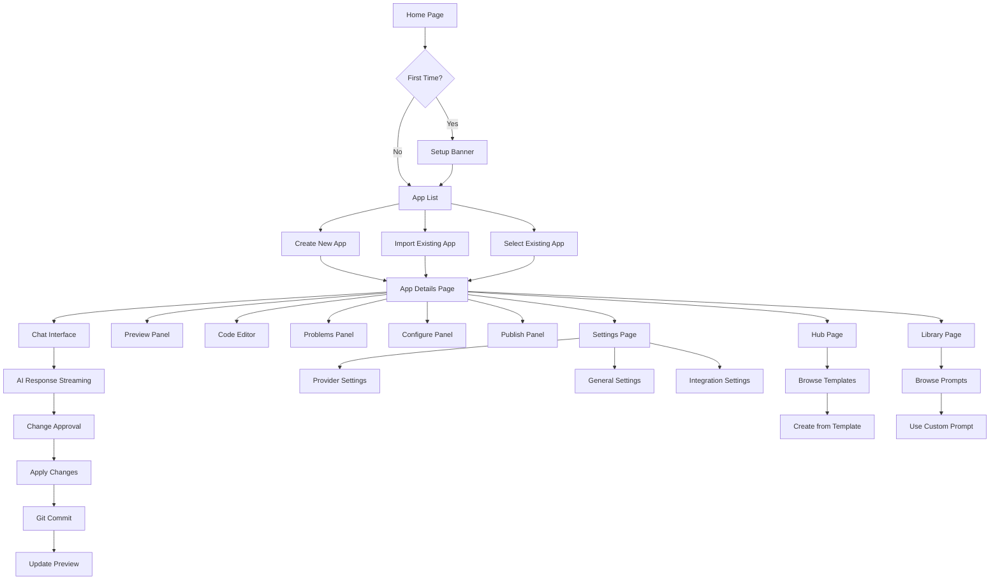

# Dyad Application Blueprint

## Overview
Dyad is a local, open-source AI app builder that runs entirely on the user's machine. It provides an alternative to cloud-based AI app builders like Lovable, v0, and Bolt, with full control over data and API keys.

## Tech Stack

### Core Technologies
- **Electron**: Cross-platform desktop application framework
- **React 19**: Frontend UI library
- **TypeScript**: Type-safe JavaScript
- **TanStack Router**: Client-side routing
- **TailwindCSS**: Utility-first CSS framework
- **Radix UI**: Accessible component primitives
- **Jotai**: Lightweight state management

### Backend & Data
- **Node.js**: Server-side runtime (Electron main process)
- **Better SQLite3**: Local database engine
- **Drizzle ORM**: Type-safe database queries
- **IPC**: Inter-process communication between main/renderer processes

### AI & LLM Integration
- **AI SDK**: Unified interface for multiple LLM providers
- **Supported Providers**: OpenAI, Anthropic, Google, Azure, xAI, OpenRouter, and custom providers
- **MCP (Model Context Protocol)**: Extensible tool system for AI agents

### Development Tools
- **Vite**: Build tool and dev server
- **ESLint + Oxlint**: Code linting
- **Prettier**: Code formatting
- **Vitest**: Unit testing
- **Playwright**: End-to-end testing
- **Electron Forge**: Application packaging

## Architecture

### Electron Architecture
```
┌─────────────────┐    IPC    ┌─────────────────┐
│   Main Process  │◄────────►│ Renderer Process │
│   (Node.js)     │           │   (React)       │
│                 │           │                 │
│ • File System   │           │ • UI Components │
│ • Database      │           │ • State Mgmt    │
│ • Git Operations│           │ • Routing       │
│ • AI Requests   │           │ • User Input    │
│ • External APIs │           │                 │
└─────────────────┘           └─────────────────┘
```

### Application Structure
```
src/
├── main.ts              # Electron main process entry
├── preload.ts           # Secure API bridge
├── renderer.tsx         # React app entry
├── router.ts            # Route configuration
├── db/                  # Database schema & connection
├── ipc/                 # Inter-process communication
│   ├── ipc_host.ts      # Main process IPC handlers
│   ├── ipc_client.ts    # Renderer IPC client
│   └── handlers/        # IPC handler implementations
├── pages/               # Route components
├── components/          # Reusable UI components
├── hooks/               # React hooks
├── atoms/               # Jotai state atoms
├── lib/                 # Utilities & schemas
├── prompts/             # AI system prompts
└── shared/              # Shared code
```

## Core Features

### 1. AI-Powered App Building
- **Conversational Interface**: Chat-based app creation and modification
- **Code Generation**: AI generates complete applications from user prompts
- **Context-Aware**: Sends entire codebase for context-rich responses
- **Streaming Responses**: Real-time display of AI-generated code
- **Approval Workflow**: User reviews and approves changes before application

### 2. Local Development Environment
- **Integrated Preview**: Live preview of generated applications
- **Hot Reloading**: Automatic updates during development
- **File System Integration**: Direct manipulation of project files
- **Git Version Control**: Automatic commits for each change
- **Dependency Management**: Automatic package installation

### 3. Multi-Provider LLM Support
- **Provider Flexibility**: Support for 10+ AI providers
- **Custom Models**: Add custom API endpoints and models
- **Token Management**: Usage tracking and cost monitoring
- **Smart Context**: AI-powered context selection for large codebases

### 4. Third-Party Integrations
- **Supabase**: Database and backend-as-a-service
- **Neon**: Serverless PostgreSQL
- **Vercel**: Deployment platform
- **GitHub**: Code hosting and collaboration

### 5. Advanced Features
- **Templates**: Pre-built app templates
- **Prompts**: Customizable system prompts
- **MCP Servers**: Extensible tool ecosystem
- **Pro Mode**: Advanced AI features (paid)
- **Telemetry**: Optional usage analytics

## Page Flow Diagram



## Database Schema

### Core Tables

#### apps
```sql
CREATE TABLE apps (
  id INTEGER PRIMARY KEY AUTOINCREMENT,
  name TEXT NOT NULL,
  path TEXT NOT NULL,
  created_at INTEGER NOT NULL DEFAULT (unixepoch()),
  updated_at INTEGER NOT NULL DEFAULT (unixepoch()),
  github_org TEXT,
  github_repo TEXT,
  github_branch TEXT,
  supabase_project_id TEXT,
  supabase_parent_project_id TEXT,
  neon_project_id TEXT,
  neon_development_branch_id TEXT,
  neon_preview_branch_id TEXT,
  vercel_project_id TEXT,
  vercel_project_name TEXT,
  vercel_team_id TEXT,
  vercel_deployment_url TEXT,
  install_command TEXT,
  start_command TEXT,
  chat_context TEXT, -- JSON
  is_favorite INTEGER NOT NULL DEFAULT 0
);
```

#### chats
```sql
CREATE TABLE chats (
  id INTEGER PRIMARY KEY AUTOINCREMENT,
  app_id INTEGER NOT NULL REFERENCES apps(id) ON DELETE CASCADE,
  title TEXT,
  initial_commit_hash TEXT,
  created_at INTEGER NOT NULL DEFAULT (unixepoch())
);
```

#### messages
```sql
CREATE TABLE messages (
  id INTEGER PRIMARY KEY AUTOINCREMENT,
  chat_id INTEGER NOT NULL REFERENCES chats(id) ON DELETE CASCADE,
  role TEXT NOT NULL CHECK (role IN ('user', 'assistant')),
  content TEXT NOT NULL,
  approval_state TEXT CHECK (approval_state IN ('approved', 'rejected')),
  commit_hash TEXT,
  request_id TEXT,
  created_at INTEGER NOT NULL DEFAULT (unixepoch())
);
```

#### versions
```sql
CREATE TABLE versions (
  id INTEGER PRIMARY KEY AUTOINCREMENT,
  app_id INTEGER NOT NULL REFERENCES apps(id) ON DELETE CASCADE,
  commit_hash TEXT NOT NULL,
  neon_db_timestamp TEXT,
  created_at INTEGER NOT NULL DEFAULT (unixepoch()),
  updated_at INTEGER NOT NULL DEFAULT (unixepoch()),
  UNIQUE(app_id, commit_hash)
);
```

### AI/ML Tables

#### language_model_providers
```sql
CREATE TABLE language_model_providers (
  id TEXT PRIMARY KEY,
  name TEXT NOT NULL,
  api_base_url TEXT NOT NULL,
  env_var_name TEXT,
  created_at INTEGER NOT NULL DEFAULT (unixepoch()),
  updated_at INTEGER NOT NULL DEFAULT (unixepoch())
);
```

#### language_models
```sql
CREATE TABLE language_models (
  id INTEGER PRIMARY KEY AUTOINCREMENT,
  display_name TEXT NOT NULL,
  api_name TEXT NOT NULL,
  builtin_provider_id TEXT,
  custom_provider_id TEXT REFERENCES language_model_providers(id) ON DELETE CASCADE,
  description TEXT,
  max_output_tokens INTEGER,
  context_window INTEGER,
  created_at INTEGER NOT NULL DEFAULT (unixepoch()),
  updated_at INTEGER NOT NULL DEFAULT (unixepoch())
);
```

### MCP Tables

#### mcp_servers
```sql
CREATE TABLE mcp_servers (
  id INTEGER PRIMARY KEY AUTOINCREMENT,
  name TEXT NOT NULL,
  transport TEXT NOT NULL,
  command TEXT,
  args TEXT, -- JSON array
  env_json TEXT, -- JSON object
  url TEXT,
  enabled INTEGER NOT NULL DEFAULT 0,
  created_at INTEGER NOT NULL DEFAULT (unixepoch()),
  updated_at INTEGER NOT NULL DEFAULT (unixepoch())
);
```

#### mcp_tool_consents
```sql
CREATE TABLE mcp_tool_consents (
  id INTEGER PRIMARY KEY AUTOINCREMENT,
  server_id INTEGER NOT NULL REFERENCES mcp_servers(id) ON DELETE CASCADE,
  tool_name TEXT NOT NULL,
  consent TEXT NOT NULL DEFAULT 'ask',
  updated_at INTEGER NOT NULL DEFAULT (unixepoch()),
  UNIQUE(server_id, tool_name)
);
```

### Utility Tables

#### prompts
```sql
CREATE TABLE prompts (
  id INTEGER PRIMARY KEY AUTOINCREMENT,
  title TEXT NOT NULL,
  description TEXT,
  content TEXT NOT NULL,
  created_at INTEGER NOT NULL DEFAULT (unixepoch()),
  updated_at INTEGER NOT NULL DEFAULT (unixepoch())
);
```

## Key Components & Functions

### Main Process (Electron Backend)

#### IPC Handlers
- **App Handlers**: Create, delete, update apps; run apps; manage app lifecycle
- **Chat Handlers**: CRUD operations for chats and messages; chat search
- **Chat Stream Handlers**: AI conversation streaming; response processing
- **Settings Handlers**: User preferences and configuration
- **Provider Handlers**: AI model and provider management
- **Integration Handlers**: Supabase, Neon, Vercel, GitHub integrations
- **MCP Handlers**: Model Context Protocol server management

#### Core Services
- **Database Service**: SQLite operations via Drizzle ORM
- **Git Service**: Version control integration
- **File System Service**: Safe file operations
- **AI Service**: LLM API integrations
- **Backup Service**: Automatic data backup

### Renderer Process (React Frontend)

#### Page Components
- **HomePage**: App listing, creation, and onboarding
- **HubPage**: Template browsing and selection
- **LibraryPage**: Prompt management
- **ChatPage**: AI conversation interface
- **AppDetailsPage**: App management and development interface
- **SettingsPage**: User preferences and configuration

#### Key Components
- **ChatPanel**: Message display and input
- **PreviewPanel**: Live app preview
- **AppSidebar**: Navigation and app selection
- **ModelPicker**: AI model selection
- **ProviderSettings**: API key configuration
- **IntegrationConnectors**: Third-party service connections

#### State Management (Jotai Atoms)
- **appAtoms**: Current app, app list, versions
- **chatAtoms**: Chat state, streaming, messages
- **settingsAtoms**: User preferences
- **uiAtoms**: UI state (panels, dialogs, etc.)

### AI Response Processing

#### System Prompt Structure
```xml
<dyad-write path="file.ts">
  // Generated code
</dyad-write>

<dyad-add-dependency name="package" version="1.0.0">
  Description
</dyad-add-dependency>

<dyad-execute-sql>
  SQL commands
</dyad-execute-sql>
```

#### Response Processing Flow
1. **Parse XML Tags**: Extract actions from AI response
2. **Validate Actions**: Ensure safe operations
3. **Execute Actions**: Apply changes to filesystem/database
4. **Git Commit**: Version control changes
5. **Update UI**: Reflect changes in preview

### File Structure Reference

```
/
├── src/
│   ├── main.ts                    # Electron main process
│   ├── preload.ts                 # IPC bridge
│   ├── renderer.tsx               # React app entry
│   ├── router.ts                  # Route configuration
│   ├── db/
│   │   ├── index.ts               # Database connection
│   │   └── schema.ts              # Database schema
│   ├── ipc/
│   │   ├── ipc_host.ts            # IPC handler registration
│   │   ├── ipc_client.ts          # IPC client
│   │   ├── handlers/              # IPC handlers (30+ files)
│   │   └── processors/
│   │       └── response_processor.ts # AI response processing
│   ├── pages/                     # Route components (6 files)
│   ├── components/                # UI components (140+ files)
│   │   ├── chat/                  # Chat-related components
│   │   ├── ui/                    # Base UI components
│   │   └── [feature]/             # Feature-specific components
│   ├── hooks/                     # React hooks (40+ files)
│   ├── atoms/                     # Jotai state atoms
│   ├── lib/                       # Utilities and schemas
│   ├── prompts/                   # AI system prompts
│   └── shared/                    # Shared utilities
├── drizzle/                       # Database migrations
├── packages/                      # Internal packages
├── e2e-tests/                     # End-to-end tests
├── scripts/                       # Build and utility scripts
└── [config files]                 # Various config files
```

## Development Workflow

### Creating a New App
1. User enters prompt on Home page
2. AI generates complete app structure
3. Changes displayed in chat interface
4. User approves changes
5. Response processor applies changes
6. Git commit created
7. Preview updates automatically

### Integrating Third-Party Services
1. User connects service (Supabase/Neon/Vercel)
2. OAuth flow completes
3. Credentials stored securely
4. Service available in app development
5. AI can generate service-specific code

### Using MCP Tools
1. User enables MCP server
2. Tools registered with AI
3. Consent requested for tool usage
4. AI can use tools during conversation
5. Results integrated into response

## Key Configuration

### Environment Variables
- `DYAD_ENGINE_URL`: Custom LLM engine URL
- Provider API keys (encrypted in settings)
- Database paths
- User data directories

### Settings Schema
- AI provider configurations
- UI preferences
- Telemetry consent
- Auto-update settings
- Experimental features

## Maintenance & Updates

### Database Migrations
- Version-controlled schema changes
- Automatic migration on app startup
- Backwards compatibility maintained

### Version Control
- Git integration for all apps
- Automatic commits for AI changes
- Branch management for features
- Version history and rollback

### Backup System
- Automatic database backup
- Settings file backup
- Recovery mechanisms
- Data integrity checks

---

*This blueprint serves as the comprehensive reference for the Dyad codebase. Update this file whenever significant changes are made to maintain accurate documentation.*
