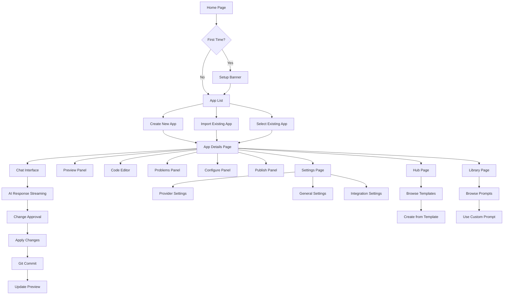
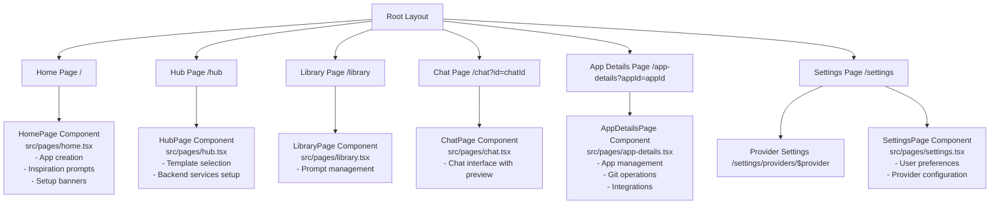
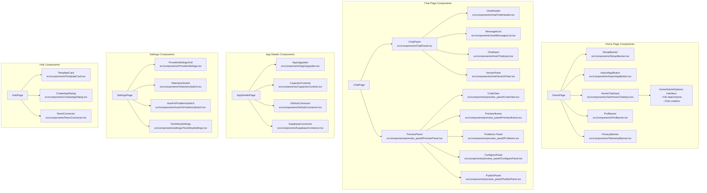
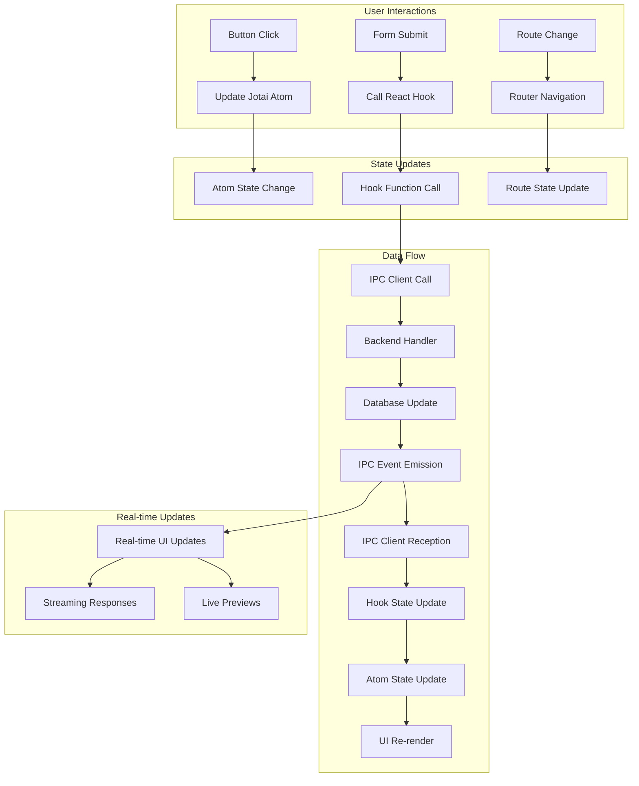

# Dyad Application Blueprint

## Overview
Dyad is a local, open-source AI app builder that runs entirely on the user's machine. It provides an alternative to cloud-based AI app builders like Lovable, v0, and Bolt, with full control over data and API keys.

## Tech Stack

### Core Technologies
- **Electron**: Cross-platform desktop application framework
- **React 19**: Frontend UI library
- **TypeScript**: Type-safe JavaScript
- **TanStack Router**: Client-side routing
- **TailwindCSS**: Utility-first CSS framework
- **Radix UI**: Accessible component primitives
- **Jotai**: Lightweight state management

### Backend & Data
- **Node.js**: Server-side runtime (Electron main process)
- **Better SQLite3**: Local database engine
- **Drizzle ORM**: Type-safe database queries
- **IPC**: Inter-process communication between main/renderer processes

### AI & LLM Integration
- **AI SDK**: Unified interface for multiple LLM providers
- **Supported Providers**: OpenAI, Anthropic, Google, Azure, xAI, OpenRouter, and custom providers
- **MCP (Model Context Protocol)**: Extensible tool system for AI agents

### Development Tools
- **Vite**: Build tool and dev server
- **ESLint + Oxlint**: Code linting
- **Prettier**: Code formatting
- **Vitest**: Unit testing
- **Playwright**: End-to-end testing
- **Electron Forge**: Application packaging

## Architecture

### Electron Architecture
```
┌─────────────────┐    IPC    ┌─────────────────┐
│   Main Process  │◄────────►│ Renderer Process │
│   (Node.js)     │           │   (React)       │
│                 │           │                 │
│ • File System   │           │ • UI Components │
│ • Database      │           │ • State Mgmt    │
│ • Git Operations│           │ • Routing       │
│ • AI Requests   │           │ • User Input    │
│ • External APIs │           │                 │
└─────────────────┘           └─────────────────┘
```

### Application Structure
```
src/
├── main.ts              # Electron main process entry
├── preload.ts           # Secure API bridge
├── renderer.tsx         # React app entry
├── router.ts            # Route configuration
├── db/                  # Database schema & connection
├── ipc/                 # Inter-process communication
│   ├── ipc_host.ts      # Main process IPC handlers
│   ├── ipc_client.ts    # Renderer IPC client
│   └── handlers/        # IPC handler implementations
├── pages/               # Route components
├── components/          # Reusable UI components
├── hooks/               # React hooks
├── atoms/               # Jotai state atoms
├── lib/                 # Utilities & schemas
├── prompts/             # AI system prompts
└── shared/              # Shared code
```

## Core Features

### 1. AI-Powered App Building
- **Conversational Interface**: Chat-based app creation and modification
- **Code Generation**: AI generates complete applications from user prompts
- **Context-Aware**: Sends entire codebase for context-rich responses
- **Streaming Responses**: Real-time display of AI-generated code
- **Approval Workflow**: User reviews and approves changes before application

### 2. Local Development Environment
- **Integrated Preview**: Live preview of generated applications
- **Hot Reloading**: Automatic updates during development
- **File System Integration**: Direct manipulation of project files
- **Git Version Control**: Automatic commits for each change
- **Dependency Management**: Automatic package installation

### 3. Multi-Provider LLM Support
- **Provider Flexibility**: Support for 10+ AI providers
- **Custom Models**: Add custom API endpoints and models
- **Token Management**: Usage tracking and cost monitoring
- **Smart Context**: AI-powered context selection for large codebases

### 4. Third-Party Integrations
- **Supabase**: Database and backend-as-a-service
- **Neon**: Serverless PostgreSQL
- **Vercel**: Deployment platform
- **GitHub**: Code hosting and collaboration

### 5. Advanced Features
- **Templates**: Pre-built app templates
- **Prompts**: Customizable system prompts
- **MCP Servers**: Extensible tool ecosystem
- **Pro Mode**: Advanced AI features (paid)
- **Telemetry**: Optional usage analytics

## Page Flow Diagram



## Database Schema

### Core Tables

#### apps
```sql
CREATE TABLE apps (
  id INTEGER PRIMARY KEY AUTOINCREMENT,
  name TEXT NOT NULL,
  path TEXT NOT NULL,
  created_at INTEGER NOT NULL DEFAULT (unixepoch()),
  updated_at INTEGER NOT NULL DEFAULT (unixepoch()),
  github_org TEXT,
  github_repo TEXT,
  github_branch TEXT,
  supabase_project_id TEXT,
  supabase_parent_project_id TEXT,
  neon_project_id TEXT,
  neon_development_branch_id TEXT,
  neon_preview_branch_id TEXT,
  vercel_project_id TEXT,
  vercel_project_name TEXT,
  vercel_team_id TEXT,
  vercel_deployment_url TEXT,
  install_command TEXT,
  start_command TEXT,
  chat_context TEXT, -- JSON
  is_favorite INTEGER NOT NULL DEFAULT 0
);
```

#### chats
```sql
CREATE TABLE chats (
  id INTEGER PRIMARY KEY AUTOINCREMENT,
  app_id INTEGER NOT NULL REFERENCES apps(id) ON DELETE CASCADE,
  title TEXT,
  initial_commit_hash TEXT,
  created_at INTEGER NOT NULL DEFAULT (unixepoch())
);
```

#### messages
```sql
CREATE TABLE messages (
  id INTEGER PRIMARY KEY AUTOINCREMENT,
  chat_id INTEGER NOT NULL REFERENCES chats(id) ON DELETE CASCADE,
  role TEXT NOT NULL CHECK (role IN ('user', 'assistant')),
  content TEXT NOT NULL,
  approval_state TEXT CHECK (approval_state IN ('approved', 'rejected')),
  commit_hash TEXT,
  request_id TEXT,
  created_at INTEGER NOT NULL DEFAULT (unixepoch())
);
```

#### versions
```sql
CREATE TABLE versions (
  id INTEGER PRIMARY KEY AUTOINCREMENT,
  app_id INTEGER NOT NULL REFERENCES apps(id) ON DELETE CASCADE,
  commit_hash TEXT NOT NULL,
  neon_db_timestamp TEXT,
  created_at INTEGER NOT NULL DEFAULT (unixepoch()),
  updated_at INTEGER NOT NULL DEFAULT (unixepoch()),
  UNIQUE(app_id, commit_hash)
);
```

### AI/ML Tables

#### language_model_providers
```sql
CREATE TABLE language_model_providers (
  id TEXT PRIMARY KEY,
  name TEXT NOT NULL,
  api_base_url TEXT NOT NULL,
  env_var_name TEXT,
  created_at INTEGER NOT NULL DEFAULT (unixepoch()),
  updated_at INTEGER NOT NULL DEFAULT (unixepoch())
);
```

#### language_models
```sql
CREATE TABLE language_models (
  id INTEGER PRIMARY KEY AUTOINCREMENT,
  display_name TEXT NOT NULL,
  api_name TEXT NOT NULL,
  builtin_provider_id TEXT,
  custom_provider_id TEXT REFERENCES language_model_providers(id) ON DELETE CASCADE,
  description TEXT,
  max_output_tokens INTEGER,
  context_window INTEGER,
  created_at INTEGER NOT NULL DEFAULT (unixepoch()),
  updated_at INTEGER NOT NULL DEFAULT (unixepoch())
);
```

### MCP Tables

#### mcp_servers
```sql
CREATE TABLE mcp_servers (
  id INTEGER PRIMARY KEY AUTOINCREMENT,
  name TEXT NOT NULL,
  transport TEXT NOT NULL,
  command TEXT,
  args TEXT, -- JSON array
  env_json TEXT, -- JSON object
  url TEXT,
  enabled INTEGER NOT NULL DEFAULT 0,
  created_at INTEGER NOT NULL DEFAULT (unixepoch()),
  updated_at INTEGER NOT NULL DEFAULT (unixepoch())
);
```

#### mcp_tool_consents
```sql
CREATE TABLE mcp_tool_consents (
  id INTEGER PRIMARY KEY AUTOINCREMENT,
  server_id INTEGER NOT NULL REFERENCES mcp_servers(id) ON DELETE CASCADE,
  tool_name TEXT NOT NULL,
  consent TEXT NOT NULL DEFAULT 'ask',
  updated_at INTEGER NOT NULL DEFAULT (unixepoch()),
  UNIQUE(server_id, tool_name)
);
```

### Utility Tables

#### prompts
```sql
CREATE TABLE prompts (
  id INTEGER PRIMARY KEY AUTOINCREMENT,
  title TEXT NOT NULL,
  description TEXT,
  content TEXT NOT NULL,
  created_at INTEGER NOT NULL DEFAULT (unixepoch()),
  updated_at INTEGER NOT NULL DEFAULT (unixepoch())
);
```

## Key Components & Functions

### Main Process (Electron Backend)

#### IPC Handlers
- **App Handlers**: Create, delete, update apps; run apps; manage app lifecycle
- **Chat Handlers**: CRUD operations for chats and messages; chat search
- **Chat Stream Handlers**: AI conversation streaming; response processing
- **Settings Handlers**: User preferences and configuration
- **Provider Handlers**: AI model and provider management
- **Integration Handlers**: Supabase, Neon, Vercel, GitHub integrations
- **MCP Handlers**: Model Context Protocol server management

#### Core Services
- **Database Service**: SQLite operations via Drizzle ORM
- **Git Service**: Version control integration
- **File System Service**: Safe file operations
- **AI Service**: LLM API integrations
- **Backup Service**: Automatic data backup

### Renderer Process (React Frontend)

#### Page Components
- **HomePage**: App listing, creation, and onboarding
- **HubPage**: Template browsing and selection
- **LibraryPage**: Prompt management
- **ChatPage**: AI conversation interface
- **AppDetailsPage**: App management and development interface
- **SettingsPage**: User preferences and configuration

#### Key Components
- **ChatPanel**: Message display and input
- **PreviewPanel**: Live app preview
- **AppSidebar**: Navigation and app selection
- **ModelPicker**: AI model selection
- **ProviderSettings**: API key configuration
- **IntegrationConnectors**: Third-party service connections

#### State Management (Jotai Atoms)
- **appAtoms**: Current app, app list, versions
- **chatAtoms**: Chat state, streaming, messages
- **settingsAtoms**: User preferences
- **uiAtoms**: UI state (panels, dialogs, etc.)

### AI Response Processing

#### System Prompt Structure
```xml
<dyad-write path="file.ts">
  // Generated code
</dyad-write>

<dyad-add-dependency name="package" version="1.0.0">
  Description
</dyad-add-dependency>

<dyad-execute-sql>
  SQL commands
</dyad-execute-sql>
```

#### Response Processing Flow
1. **Parse XML Tags**: Extract actions from AI response
2. **Validate Actions**: Ensure safe operations
3. **Execute Actions**: Apply changes to filesystem/database
4. **Git Commit**: Version control changes
5. **Update UI**: Reflect changes in preview

### File Structure Reference

```
/
├── src/
│   ├── main.ts                    # Electron main process
│   ├── preload.ts                 # IPC bridge
│   ├── renderer.tsx               # React app entry
│   ├── router.ts                  # Route configuration
│   ├── db/
│   │   ├── index.ts               # Database connection
│   │   └── schema.ts              # Database schema
│   ├── ipc/
│   │   ├── ipc_host.ts            # IPC handler registration
│   │   ├── ipc_client.ts          # IPC client
│   │   ├── handlers/              # IPC handlers (30+ files)
│   │   └── processors/
│   │       └── response_processor.ts # AI response processing
│   ├── pages/                     # Route components (6 files)
│   ├── components/                # UI components (140+ files)
│   │   ├── chat/                  # Chat-related components
│   │   ├── ui/                    # Base UI components
│   │   └── [feature]/             # Feature-specific components
│   ├── hooks/                     # React hooks (40+ files)
│   ├── atoms/                     # Jotai state atoms
│   ├── lib/                       # Utilities and schemas
│   ├── prompts/                   # AI system prompts
│   └── shared/                    # Shared utilities
├── drizzle/                       # Database migrations
├── packages/                      # Internal packages
├── e2e-tests/                     # End-to-end tests
├── scripts/                       # Build and utility scripts
└── [config files]                 # Various config files
```

## Development Workflow

### Creating a New App
1. User enters prompt on Home page
2. AI generates complete app structure
3. Changes displayed in chat interface
4. User approves changes
5. Response processor applies changes
6. Git commit created
7. Preview updates automatically

### Integrating Third-Party Services
1. User connects service (Supabase/Neon/Vercel)
2. OAuth flow completes
3. Credentials stored securely
4. Service available in app development
5. AI can generate service-specific code

### Using MCP Tools
1. User enables MCP server
2. Tools registered with AI
3. Consent requested for tool usage
4. AI can use tools during conversation
5. Results integrated into response

## Key Configuration

### Environment Variables
- `DYAD_ENGINE_URL`: Custom LLM engine URL
- Provider API keys (encrypted in settings)
- Database paths
- User data directories

### Settings Schema
- AI provider configurations
- UI preferences
- Telemetry consent
- Auto-update settings
- Experimental features

## Maintenance & Updates

### Database Migrations
- Version-controlled schema changes
- Automatic migration on app startup
- Backwards compatibility maintained

### Version Control
- Git integration for all apps
- Automatic commits for AI changes
- Branch management for features
- Version history and rollback

### Backup System
- Automatic database backup
- Settings file backup
- Recovery mechanisms
- Data integrity checks

---

## Recent Changes (2025-01-24)

### Pro Feature Unlocking
All Dyad Pro restrictions have been removed to enable full access to premium features without subscription requirements:

**Code Changes:**
- `src/lib/schemas.ts`: Modified `hasDyadProKey()` and `isDyadProEnabled()` functions to always return `true`
- `src/components/ProBanner.tsx`: Updated to always show "Manage Dyad Pro subscription" instead of restriction banners
- `src/components/ProModeSelector.tsx`: Removed Pro key requirements and UI restrictions

**Features Now Always Available:**
- Turbo Edits (Lazy Edits Mode)
- Smart Context (Conservative/Balanced modes)
- Web Search functionality
- All premium AI models and providers
- Advanced chat modes

**Repository Migration:**
- Disconnected from original `dyad-sh/dyad` repository
- Created new repository at `9pros/dyad-new`
- All changes committed and pushed to new repository

## Frontend Architecture & Component Diagram

### Page Structure & Routing



### Component Hierarchy & Data Flow



### Component Data Flow & Backend Connections

```mermaid
graph TD
    subgraph "Frontend Components"
        FC1[HomeChatInput] --> FC2[useStreamChat Hook]
        FC3[ChatInput] --> FC4[useStreamChat Hook]
        FC5[ModelPicker] --> FC6[useSettings Hook]
        FC7[ProviderSettings] --> FC8[useSettings Hook]
        FC9[AppList] --> FC10[useLoadApps Hook]
        FC11[ChatList] --> FC12[useChats Hook]
    end

    subgraph "React Hooks"
        RH1[useStreamChat<br/>src/hooks/useStreamChat.ts] --> RH2[IpcClient.streamMessage]
        RH3[useSettings<br/>src/hooks/useSettings.ts] --> RH4[IpcClient.getSettings]
        RH5[useLoadApps<br/>src/hooks/useLoadApps.ts] --> RH6[IpcClient.getApps]
        RH7[useChats<br/>src/hooks/useChats.ts] --> RH8[IpcClient.getChats]
        RH9[useRunApp<br/>src/hooks/useRunApp.ts] --> RH10[IpcClient.runApp]
        RH11[useTemplates<br/>src/hooks/useTemplates.ts] --> RH12[IpcClient.getTemplates]
    end

    subgraph "IPC Client"
        IC1[IpcClient<br/>src/ipc/ipc_client.ts] --> IC2[IPC Renderer Process]
    end

    subgraph "Main Process IPC Handlers"
        IP1[chat_stream_handlers<br/>src/ipc/handlers/chat_stream_handlers.ts] --> IP2[AI Model Processing]
        IP3[app_handlers<br/>src/ipc/handlers/app_handlers.ts] --> IP4[File System Operations]
        IP5[settings_handlers<br/>src/ipc/handlers/settings_handlers.ts] --> IP6[Settings Management]
        IP7[github_handlers<br/>src/ipc/handlers/github_handlers.ts] --> IP8[GitHub API]
        IP9[supabase_handlers<br/>src/ipc/handlers/supabase_handlers.ts] --> IP10[Supabase API]
        IP10[vercel_handlers<br/>src/ipc/handlers/vercel_handlers.ts] --> IP11[Vercel API]
        IP12[neon_handlers<br/>src/ipc/handlers/neon_handlers.ts] --> IP13[Neon API]
    end

    subgraph "Database Layer"
        DB1[Drizzle ORM<br/>src/db/] --> DB2[SQLite Database<br/>better-sqlite3]
        DB1 --> DB3[Schema<br/>src/db/schema.ts]
    end

    subgraph "External Services"
        ES1[AI Providers<br/>OpenAI, Anthropic, etc.] --> ES2[AI SDK Integration]
        ES2[GitHub API] --> ES3[Repository Management]
        ES4[Supabase API] --> ES5[Backend Services]
        ES6[Vercel API] --> ES7[Deployment]
        ES8[Neon API] --> ES9[Database Hosting]
    end

    FC2 --> IC1
    RH2 --> IP1
    IP4 --> DB1
    DB2 --> DB3
    IP8 --> ES2
    IP10 --> ES4
    IP11 --> ES6
    IP13 --> ES8
```



### Detailed Component Inventory

#### Core Pages (`src/pages/`)

| Page | File | Key Components | Backend Connections | Features |
|------|------|----------------|-------------------|----------|
| **Home** | `home.tsx` | SetupBanner, HomeChatInput, ProBanner | `create-chat`, `streamMessage` | App creation, inspiration prompts, onboarding |
| **Chat** | `chat.tsx` | ChatPanel, PreviewPanel | `get-chat`, `streamMessage` | AI conversation, live preview, code editing |
| **Hub** | `hub.tsx` | TemplateCard, CreateAppDialog, NeonConnector | `get-templates`, `create-app` | Template selection, backend service setup |
| **Library** | `library.tsx` | PromptCard, CreatePromptDialog | `get-prompts`, `create-prompt` | Custom prompt management |
| **App Details** | `app-details.tsx` | AppUpgrades, GitHubConnector, SupabaseConnector | `get-app`, `rename-app`, `delete-app` | App management, integrations, git operations |
| **Settings** | `settings.tsx` | ProviderSettings, TelemetrySwitch, ToolsMcpSettings | `get-settings`, `update-settings` | User preferences, AI provider config, MCP tools |

#### Chat Components (`src/components/chat/`)

| Component | File | Purpose | Backend Calls | UI Elements |
|-----------|------|---------|---------------|-------------|
| **ChatHeader** | `ChatHeader.tsx` | Chat controls and info | `update-chat`, `delete-chat` | Title, mode selector, action buttons |
| **MessagesList** | `MessagesList.tsx` | Message display | `get-chat` | Message bubbles, timestamps, status |
| **ChatInput** | `ChatInput.tsx` | Message input | `streamMessage` | Text input, attachments, send button |
| **DyadMarkdownParser** | `DyadMarkdownParser.tsx` | Parse AI responses | N/A | Syntax highlighting, code blocks |
| **TokenBar** | `TokenBar.tsx` | Token usage display | `get-token-count` | Usage meter, cost display |
| **VersionPane** | `VersionPane.tsx` | Git version history | `get-versions` | Commit timeline, rollback |

#### Preview Panel Components (`src/components/preview_panel/`)

| Component | File | Purpose | Backend Calls | Features |
|-----------|------|---------|---------------|----------|
| **PreviewIframe** | `PreviewIframe.tsx` | Live app preview | `run-app`, `stop-app` | Web view, hot reload, error display |
| **CodeView** | `CodeView.tsx` | Code editor | `edit-app-file` | Monaco editor, syntax highlighting |
| **Problems** | `Problems.tsx` | Error display | `check-problems` | TypeScript errors, linting issues |
| **ConfigurePanel** | `ConfigurePanel.tsx` | App configuration | `update-app-config` | Environment variables, build settings |
| **PublishPanel** | `PublishPanel.tsx` | Deployment | `deploy-vercel`, `deploy-github` | Platform selection, deployment status |

#### Settings Components (`src/components/settings/`)

| Component | File | Purpose | Backend Calls | Configuration |
|-----------|------|---------|---------------|--------------|
| **ProviderSettingsPage** | `ProviderSettingsPage.tsx` | AI provider config | `update-provider-settings` | API keys, model selection |
| **ApiKeyConfiguration** | `ApiKeyConfiguration.tsx` | API key management | `validate-api-key` | Key validation, encryption |
| **ModelsSection** | `ModelsSection.tsx` | Model selection | `get-models` | Available models, custom models |
| **ToolsMcpSettings** | `ToolsMcpSettings.tsx` | MCP tool config | `get-mcp-servers`, `update-mcp-server` | Server management, tool consent |

#### Integration Components

| Component | File | Service | Backend Handlers | Features |
|-----------|------|---------|------------------|----------|
| **GitHubConnector** | `GitHubConnector.tsx` | GitHub | `github_handlers.ts` | Repo connection, deployment |
| **SupabaseConnector** | `SupabaseConnector.tsx` | Supabase | `supabase_handlers.ts` | Database setup, function deployment |
| **VercelConnector** | `VercelConnector.tsx` | Vercel | `vercel_handlers.ts` | Deployment, domain management |
| **NeonConnector** | `NeonConnector.tsx` | Neon | `neon_handlers.ts` | Database hosting, branching |

#### UI Components (`src/components/ui/`)

| Component | File | Purpose | Variants | Features |
|-----------|------|---------|----------|----------|
| **Button** | `button.tsx` | Interactive elements | default, outline, ghost, link | Loading states, icons |
| **Dialog** | `dialog.tsx` | Modal dialogs | Alert, confirmation, form | Overlay, animations |
| **Input** | `input.tsx` | Text input fields | text, password, email | Validation, icons |
| **Select** | `select.tsx` | Dropdown selection | single, multi | Search, custom options |
| **Switch** | `switch.tsx` | Toggle switches | on/off | Labels, disabled state |
| **Tooltip** | `tooltip.tsx` | Hover information | positions | Rich content |
| **Sidebar** | `sidebar.tsx` | Navigation sidebar | collapsible | App list, search |

### State Management (Jotai Atoms)

#### App State (`src/atoms/appAtoms.ts`)
- `currentAppAtom`: Current selected app
- `selectedAppIdAtom`: Active app ID
- `appsListAtom`: All user apps
- `previewModeAtom`: Current preview tab (preview/code/problems/configure/publish)
- `appOutputAtom`: Console output messages
- `appUrlAtom`: Running app URL

#### Chat State (`src/atoms/chatAtoms.ts`)
- `chatMessagesByIdAtom`: Messages per chat
- `chatStreamCountByIdAtom`: Streaming counters
- `isStreamingByIdAtom`: Streaming status
- `homeChatInputValueAtom`: Home page input

#### UI State (`src/atoms/viewAtoms.ts`)
- `isPreviewOpenAtom`: Preview panel visibility
- `activeSettingsSectionAtom`: Current settings tab

### IPC Communication Channels

#### Frontend → Backend Calls

```typescript
// Chat Operations
'create-chat' → app_handlers.ts
'get-chat' → chat_handlers.ts
'stream-message' → chat_stream_handlers.ts

// App Management
'get-apps' → app_handlers.ts
'create-app' → app_handlers.ts
'delete-app' → app_handlers.ts
'run-app' → app_handlers.ts

// Settings
'get-settings' → settings_handlers.ts
'update-settings' → settings_handlers.ts

// AI Providers
'get-models' → language_model_handlers.ts
'validate-api-key' → language_model_handlers.ts

// Integrations
'github:connect' → github_handlers.ts
'supabase:deploy' → supabase_handlers.ts
'vercel:deploy' → vercel_handlers.ts
'neon:create' → neon_handlers.ts
```

#### Backend → Frontend Events

```typescript
// Chat Streaming
'chat:response:chunk' → Message updates
'chat:response:end' → Stream completion
'chat:response:error' → Error handling

// App Execution
'app:output' → Console messages
'app:started' → App launch confirmation
'app:stopped' → App termination

// File Operations
'app:file-changed' → Code updates
'app:problems-updated' → Error status
```

### Component Props & Data Flow

#### Key Component Interfaces

```typescript
interface ChatPanelProps {
  chatId?: number;
  isPreviewOpen: boolean;
  onTogglePreview: () => void;
}

interface PreviewPanelProps {
  // Managed via atoms - no direct props
}

interface ChatInputProps {
  chatId: number;
  disabled?: boolean;
  placeholder?: string;
}

interface ModelPickerProps {
  value?: LargeLanguageModel;
  onChange: (model: LargeLanguageModel) => void;
  disabled?: boolean;
}
```

### Error Handling & Loading States

#### Global Error Boundaries
- `ErrorBoundary` component catches React errors
- Displays user-friendly error messages
- Reports errors to logging system

#### Loading States
- Skeleton components for initial loads
- Spinner overlays for async operations
- Progress indicators for long-running tasks

#### Toast Notifications
- Success messages for completed actions
- Error messages for failed operations
- Info messages for status updates

### Accessibility & Internationalization

#### Accessibility Features
- ARIA labels on interactive elements
- Keyboard navigation support
- Screen reader compatibility
- High contrast mode support

#### UI Patterns
- Consistent spacing (Tailwind classes)
- Standardized color scheme
- Responsive design (mobile to desktop)
- Dark/light theme support

### Detailed Interactive Elements & Button Inventory

#### Home Page (`/`) - Interactive Elements

| Element | Component | Location | Action | Backend Call | State Changes |
|---------|-----------|----------|--------|--------------|---------------|
| **Chat Input** | `HomeChatInput`<br/>`src/components/chat/HomeChatInput.tsx` | Center form | Submit prompt → Create app & chat | `create-chat`, `streamMessage` | Navigate to `/chat?id={chatId}` |
| **Inspiration Buttons** | Dynamic buttons | Below input | Set input value | N/A | Update `homeChatInputValueAtom` |
| **More Ideas Button** | `Button` | Below inspiration buttons | Shuffle prompts | N/A | Update displayed prompts |
| **Import App Button** | `ImportAppButton`<br/>`src/components/ImportAppButton.tsx` | Top left | Open import dialog | N/A | Open `ImportAppDialog` |
| **Pro Banner** | `ProBanner`<br/>`src/components/ProBanner.tsx` | Bottom | External link | N/A | Open external URL |
| **Release Notes Dialog** | `Dialog` | Modal overlay | Show changelog | `doesReleaseNoteExist` | Display release notes iframe |
| **Setup Banner** | `SetupBanner`<br/>`src/components/SetupBanner.tsx` | Top | Provider setup | N/A | Navigate to settings |

#### Chat Page (`/chat?id={chatId}`) - Interactive Elements

| Element | Component | Location | Action | Backend Call | State Changes |
|---------|-----------|----------|--------|--------------|---------------|
| **New Chat Button** | `Button` in `ChatHeader` | Top left | Create new chat | `create-chat` | Navigate to new chat URL |
| **Version History Button** | `Button` in `ChatHeader` | Top left | Toggle version pane | N/A | Toggle `isVersionPaneOpen` |
| **Preview Toggle Button** | `button` in `ChatHeader` | Top right | Show/hide preview | N/A | Toggle `isPreviewOpenAtom` |
| **Branch Warning Banner** | `div` in `ChatHeader` | Top (conditional) | Switch to main branch | `checkout-version` | Update git branch |
| **Rename Branch Button** | `Button` in `ChatHeader` | Branch banner | Rename master→main | `rename-branch` | Update branch name |
| **Chat Input** | `LexicalChatInput`<br/>`src/components/chat/LexicalChatInput.tsx` | Bottom | Send message | `streamMessage` | Add to chat, start streaming |
| **Send Button** | `Button` in `ChatInput` | Input area | Submit message | `streamMessage` | Same as input submit |
| **Stop Button** | `Button` in `ChatInput` | Input area (streaming) | Cancel streaming | `cancel-stream` | Stop AI response |
| **Attachment Button** | `FileAttachmentDropdown` | Input area | Add files | N/A | Update attachments state |
| **Token Usage Toggle** | `Button` in `ChatInput` | Input area | Show/hide token bar | N/A | Toggle `showTokenBarAtom` |
| **Approve Button** | `Button` in `ChatInput` | After AI response | Apply changes | `processFullResponseActions` | Execute code changes |
| **Reject Button** | `Button` in `ChatInput` | After AI response | Discard changes | N/A | Clear proposal state |
| **Auto-Approve Toggle** | `AutoApproveSwitch` | Input controls | Auto-apply changes | N/A | Update settings |
| **Mode Selector** | `ChatModeSelector` | Header area | Change chat mode | N/A | Update chat behavior |

#### Preview Panel - Interactive Elements

| Element | Component | Location | Action | Backend Call | State Changes |
|---------|-----------|----------|--------|--------------|---------------|
| **Tab Navigation** | `Button` group | Top tabs | Switch views | N/A | Update `previewModeAtom` |
| **Preview Tab** | `Button` | Tab bar | Live app view | N/A | Set mode to "preview" |
| **Code Tab** | `Button` | Tab bar | Code editor | N/A | Set mode to "code" |
| **Problems Tab** | `Button` | Tab bar | Error display | N/A | Set mode to "problems" |
| **Configure Tab** | `Button` | Tab bar | App settings | N/A | Set mode to "configure" |
| **Publish Tab** | `Button` | Tab bar | Deployment | N/A | Set mode to "publish" |
| **Console Toggle** | `Button` | Bottom | Show/hide console | N/A | Toggle console visibility |
| **Run/Stop App** | `Button` in `PreviewIframe` | Preview header | Start/stop app | `run-app`, `stop-app` | Update app status |
| **File Tree Items** | `div` elements | Left sidebar | Select file | N/A | Open file in editor |
| **Monaco Editor** | `MonacoEditor` | Code view | Edit files | `edit-app-file` | Save file changes |
| **Configure Inputs** | Various `Input` | Configure panel | Update settings | `update-app-config` | Save configuration |
| **Deploy Buttons** | `Button` in `PublishPanel` | Publish panel | Deploy app | `deploy-vercel`, `deploy-github` | Start deployment |

#### App Details Page (`/app-details?appId={appId}`) - Interactive Elements

| Element | Component | Location | Action | Backend Call | State Changes |
|---------|-----------|----------|--------|--------------|---------------|
| **Back Button** | `Button` | Top left | Navigate back | N/A | Router navigation |
| **App Menu Button** | `Button` with `Popover` | Top right | Show actions menu | N/A | Open popover menu |
| **Rename App Button** | `Button` in menu | Popover | Open rename dialog | N/A | Show rename dialog |
| **Copy App Button** | `Button` in menu | Popover | Open copy dialog | N/A | Show copy dialog |
| **Delete App Button** | `Button` in menu | Popover | Open delete dialog | N/A | Show delete confirmation |
| **Chat Button** | `Button` | App info section | Start new chat | `create-chat` | Navigate to chat page |
| **GitHub Connect** | `GitHubConnector` | Integration section | Link GitHub repo | `github:connect` | Store GitHub credentials |
| **Supabase Connect** | `SupabaseConnector` | Integration section | Setup database | `supabase:connect` | Store Supabase config |
| **Vercel Connect** | `VercelConnector` | Integration section | Link deployment | `vercel:connect` | Store Vercel config |
| **Neon Connect** | `NeonConnector` | Integration section | Setup Neon DB | `neon:connect` | Store Neon config |
| **App Upgrades** | `AppUpgrades` | Upgrade section | Update app stack | Various upgrade calls | Update app configuration |

#### Hub Page (`/hub`) - Interactive Elements

| Element | Component | Location | Action | Backend Call | State Changes |
|---------|-----------|----------|--------|--------------|---------------|
| **Back Button** | `Button` | Top left | Navigate back | N/A | Router navigation |
| **Template Cards** | `TemplateCard` | Grid layout | Select template | N/A | Update `selectedTemplateId` |
| **Create App Button** | `Button` in `TemplateCard` | Card footer | Open create dialog | N/A | Show `CreateAppDialog` |
| **Neon Connect Button** | `NeonConnector` | Backend section | Setup database | `neon:connect` | Store Neon credentials |

#### Library Page (`/library`) - Interactive Elements

| Element | Component | Location | Action | Backend Call | State Changes |
|---------|-----------|----------|--------|--------------|---------------|
| **Create Prompt Button** | `CreatePromptDialog` | Top right | Open create dialog | N/A | Show prompt creation form |
| **Prompt Cards** | `PromptCard` | Grid layout | Display prompts | N/A | Static display |
| **Edit Prompt Button** | `CreateOrEditPromptDialog` | Card actions | Edit prompt | N/A | Show edit form |
| **Delete Prompt Button** | `DeleteConfirmationDialog` | Card actions | Delete prompt | `delete-prompt` | Remove from database |

#### Settings Page (`/settings`) - Interactive Elements

| Element | Component | Location | Action | Backend Call | State Changes |
|---------|-----------|----------|--------|--------------|---------------|
| **Back Button** | `Button` | Top left | Navigate back | N/A | Router navigation |
| **Provider Settings** | `ProviderSettingsGrid` | Main content | Configure AI providers | `update-provider-settings` | Update provider configs |
| **API Key Inputs** | `Input` fields | Provider cards | Enter credentials | `validate-api-key` | Encrypt and store keys |
| **Model Selector** | `ModelPicker` | Provider cards | Choose AI model | N/A | Update `selectedModel` |
| **Telemetry Toggle** | `TelemetrySwitch` | Telemetry section | Enable/disable tracking | `update-settings` | Update telemetry consent |
| **Auto-Fix Toggle** | `AutoFixProblemsSwitch` | Workflow section | Auto-fix errors | `update-settings` | Update auto-fix setting |
| **Update Channel** | `ReleaseChannelSelector` | General section | Choose update channel | `update-settings` | Update release channel |
| **MCP Settings** | `ToolsMcpSettings` | Tools section | Configure MCP servers | `update-mcp-server` | Update MCP configuration |
| **Reset Button** | `Button` | Danger zone | Reset all settings | `resetAll` | Clear all user data |

#### Provider Settings Page (`/settings/providers/{provider}`) - Interactive Elements

| Element | Component | Location | Action | Backend Call | State Changes |
|---------|-----------|----------|--------|--------------|---------------|
| **Back Button** | `Button` | Top | Navigate to settings | N/A | Router navigation |
| **API Key Input** | `Input` | Form section | Enter API key | `validate-api-key` | Store encrypted key |
| **Model Selection** | `Select` | Form section | Choose model | N/A | Update provider settings |
| **Advanced Options** | Various inputs | Form section | Provider-specific config | N/A | Update provider config |
| **Test Connection** | `Button` | Form section | Validate credentials | `test-provider-connection` | Show success/error |
| **Save Button** | `Button` | Form footer | Save configuration | `update-provider-settings` | Persist settings |

### Component State Management Flow



### Route-Based Component Loading

| Route Pattern | Component | File | Loader | Data Dependencies |
|---------------|-----------|------|--------|-------------------|
| `/` | `HomePage` | `src/pages/home.tsx` | None | `appsListAtom`, settings |
| `/hub` | `HubPage` | `src/pages/hub.tsx` | None | `templates`, settings |
| `/library` | `LibraryPage` | `src/pages/library.tsx` | None | `prompts` |
| `/chat?id={chatId}` | `ChatPage` | `src/pages/chat.tsx` | None | `chatId` param, chat data |
| `/app-details?appId={appId}` | `AppDetailsPage` | `src/pages/app-details.tsx` | None | `appId` param, app data |
| `/settings` | `SettingsPage` | `src/pages/settings.tsx` | None | settings data |
| `/settings/providers/$provider` | `ProviderSettingsPage` | `src/routes/settings/providers/$provider.tsx` | None | provider name param |

### Error Handling & Loading States

#### Global Error Boundaries
- **ErrorBoundary** (`src/components/ErrorBoundary.tsx`): Catches React errors, displays fallback UI
- **Toast Notifications**: Success/error/info messages via `src/lib/toast.ts`
- **Loading States**: Skeleton loaders, spinners, progress bars

#### Component-Specific Error Handling
- **Chat Errors**: `ChatErrorBox` displays streaming failures
- **Network Errors**: IPC call failures show error toasts
- **Validation Errors**: Form validation displays inline messages
- **File Operation Errors**: File system errors show specific error messages

#### Loading State Management
- **Skeleton Components**: `src/components/ui/skeleton.tsx` for initial loads
- **Loading Buttons**: Disabled state with spinner icons
- **Progress Indicators**: `LoadingBar` for long operations
- **Streaming Indicators**: Real-time progress for AI responses

### Accessibility & Keyboard Navigation

#### Keyboard Shortcuts
- **Ctrl/Cmd + Enter**: Send chat message
- **Escape**: Close modals, clear selections
- **Tab**: Navigate form fields
- **Arrow Keys**: Navigate lists and menus

#### Screen Reader Support
- **ARIA Labels**: All interactive elements have labels
- **Role Attributes**: Semantic HTML roles
- **Focus Management**: Proper focus indicators
- **Live Regions**: Screen reader announcements for dynamic content

#### Responsive Design
- **Breakpoint System**: Tailwind responsive classes
- **Mobile Navigation**: Collapsible menus, touch-friendly buttons
- **Tablet Optimization**: Medium screen layouts
- **Desktop Features**: Multi-panel layouts, keyboard shortcuts

---

## Recent Changes (2025-01-24)

### Syntax Error Fixes - Application Restored
- **Code Changes**: Fixed critical syntax errors preventing app startup
- **ProBanner.tsx**: Resolved missing newline between export functions causing 500 compilation error
- **language_model_constants.ts**: Properly closed MODEL_OPTIONS object with `};` syntax
- **Application Status**: Successfully restarted with all Qwen OAuth features functional
- **Error Resolution**: Eliminated `GET http://localhost:5173/src/components/ProBanner.tsx 500 (Internal Server Error)`
- **TypeScript Compilation**: All syntax errors resolved, app now compiles and runs correctly

### Qwen OAuth Re-implementation - Complete System Restore
- **Code Changes**: Re-implemented complete Qwen OAuth authentication system after accidental revert
- **OAuth Infrastructure**: Restored PKCE device code flow with real Qwen CLI endpoints
- **Backend Handlers**: Re-added `qwen_oauth_handlers.ts` with secure token polling
- **Frontend Components**: Restored `QwenOAuthDialog.tsx` with browser integration
- **Authentication Hooks**: Re-created `useQwenAuth.ts` for token status management
- **Provider Models**: Added comprehensive Qwen model library (9 models) with coding prioritization:
  - **Qwen3 Coder** (Best for Coding) - Most advanced coding model
  - **Qwen2.5 Coder 32B** (Advanced Coding) - Large context understanding
  - **Qwen2.5 Coder 14B** - Balanced performance/speed ratio
  - **Qwen2.5 Coder 7B** (Fast Coding) - Quick prototyping and iteration
  - **Qwen2.5 Coder 3B** - Lightweight tasks and rapid development
  - **Qwen Max** (Most Capable) - General purpose flagship model
  - **Qwen Plus** - Advanced reasoning capabilities
  - **Qwen Turbo** (Fast) - High-speed responses
  - **Qwen Math Plus** (Math) - Specialized mathematical reasoning
- **Model Client Integration**: Updated `get_model_client.ts` for DashScope API compatibility
- **Settings Schema**: Restored Qwen OAuth fields (`qwenAccessToken`, `qwenRefreshToken`, `qwenTokenExpiry`, `qwenResourceUrl`)
- **Pro Feature Activation**: Pro features now require valid Qwen OAuth tokens
- **IPC Communication**: Restored frontend-backend OAuth communication channels
- **Security**: PKCE implementation with SHA-256 code challenges
- **User Experience**: Seamless device code flow with automatic browser opening

### Project Launch Verification
- **Code Changes**: No code modifications
- **Project Status**: Successfully launched and running
- **Dependencies**: All npm packages installed (1416 packages)
- **Database**: SQLite database initialized and migrations run
- **Application**: Electron app started successfully
- **First Run**: User prompted to move to applications folder (normal behavior)

---

*This blueprint serves as the comprehensive reference for the Dyad codebase. Update this file whenever significant changes are made to maintain accurate documentation.*
